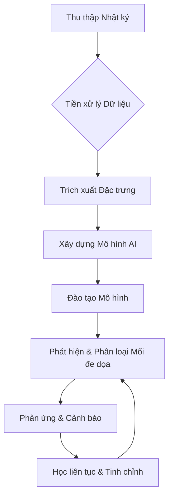

Trí tuệ nhân tạo (AI) đang cách mạng hóa lĩnh vực bảo mật thông tin bằng cách tự động hóa phát hiện mối đe dọa, tăng tốc thời gian phản hồi và chủ động củng cố hệ thống phòng thủ của tổ chức. AI vừa là công cụ để cải thiện an ninh mạng, vừa là đối tượng cần được bảo vệ khi các đối thủ ngày càng nhắm mục tiêu hoặc lạm dụng các hệ thống AI [Nguồn: Sophos, CrowdStrike, IBM, Arctic Wolf].

### Mở đầu

Trong bối cảnh kỹ thuật số ngày càng phức tạp, bảo mật thông tin đã trở thành một ưu tiên hàng đầu đối với các tổ chức và cá nhân. Sự gia tăng của các cuộc tấn công mạng tinh vi đòi hỏi những giải pháp phòng thủ tiên tiến hơn. Trí tuệ nhân tạo (AI) nổi lên như một công nghệ chủ chốt, hứa hẹn mang lại khả năng phát hiện, phân tích và ứng phó với các mối đe dọa với tốc độ và quy mô chưa từng có. Tuy nhiên, việc tích hợp AI vào bảo mật thông tin cũng đi kèm với những thách thức riêng, bao gồm việc bảo vệ chính các hệ thống AI khỏi sự tấn công và lạm dụng. Bài viết này sẽ đi sâu vào các xu hướng hiện tại, ứng dụng chính, thách thức và tác động chiến lược của AI trong bảo mật thông tin, đồng thời nhấn mạnh vai trò quan trọng của bảo mật trong việc đảm bảo tính toàn vẹn và tin cậy của các hệ thống AI.

### Nội dung chính

#### Các Xu hướng Hiện tại của AI trong Bảo Mật Thông Tin

1.  **Phát hiện và Phản hồi Mối đe dọa theo Thời gian thực:**
    Các thuật toán AI có khả năng giám sát, phân tích và phản ứng tức thì với các mối đe dọa mạng. Chúng phân tích khối lượng lớn dữ liệu mạng và điểm cuối để phát hiện các mẫu chỉ ra các cuộc tấn công hoặc lỗ hổng mới [Nguồn: Sophos, CrowdStrike, IBM, Arctic Wolf].

2.  **Phân tích Hành vi (Behavioral Analytics):**
    Bằng cách thiết lập hành vi cơ bản của người dùng và thực thể, AI nhanh chóng phát hiện các bất thường – báo hiệu các cuộc xâm nhập có thể xảy ra hoặc các mối đe dọa nội bộ, ngay cả với các phương pháp tấn công mới, tinh vi [Nguồn: Sophos, CrowdStrike, IBM].

3.  **Tự động hóa Bảo mật:**
    AI giúp hợp lý hóa các quy trình bảo mật lặp đi lặp lại như phân tích cảnh báo, phân loại sự cố và quét lỗ hổng, giảm lỗi của con người và cho phép nhân sự tập trung vào các nhiệm vụ điều tra phức tạp [Nguồn: Sophos, IBM, Arctic Wolf].

4.  **AI Tạo sinh (Generative AI) cho Phòng thủ Chủ động:**
    Các mô hình AI tạo sinh mô phỏng các kịch bản tấn công ("red-teaming"), tạo điều kiện hỗ trợ ra quyết định với các khuyến nghị bằng ngôn ngữ tự nhiên và có thể nâng cao mối tương quan tình báo mối đe dọa [Nguồn: CrowdStrike, IBM, Arctic Wolf].

5.  **Học liên tục (Continuous Learning):**
    Các hệ thống AI thích ứng nhanh chóng với các vectơ tấn công và chiến thuật mới nổi, cải thiện độ chính xác và hiệu suất theo thời gian thông qua việc tiếp xúc liên tục với dữ liệu mối đe dọa [Nguồn: Sophos, CrowdStrike, Arctic Wolf].

#### Các Ứng dụng Chính của AI trong An ninh mạng

*   **Phát hiện Mối đe dọa:** Sử dụng học máy (ML) để xác định phần mềm độc hại, lừa đảo và các bất thường đáng ngờ trên lưu lượng mạng, điểm cuối và dịch vụ đám mây [Nguồn: Sophos, CrowdStrike, Arctic Wolf].
*   **Quản lý Lỗ hổng:** Quét mạng liên tục để gắn cờ các điểm yếu và tự động đề xuất các bản vá dựa trên đánh giá rủi ro được hỗ trợ bởi AI [Nguồn: CrowdStrike].
*   **Phản ứng Sự cố:** Các công cụ ra quyết định tự động để ngăn chặn và khắc phục vi phạm nhanh chóng, bao gồm ưu tiên các sự kiện rủi ro cao [Nguồn: CrowdStrike, IBM, Arctic Wolf].
*   **Tình báo Mối đe dọa:** Tương quan các nguồn cấp dữ liệu bảo mật và đo từ xa khác nhau để cung cấp thông tin chi tiết có thể hành động, thường vượt quá phạm vi của các nhà phân tích con người [Nguồn: Arctic Wolf].
*   **Ngăn chặn Xâm nhập:** Nhận dạng và phản ứng theo thời gian thực đối với các cuộc tấn công "sống ngoài vùng đất" (living off the land) và các cuộc tấn công do AI điều khiển nhằm phá vỡ các biện pháp phòng thủ truyền thống [Nguồn: Sophos, CrowdStrike, Arctic Wolf].

#### Bảo vệ Hệ thống AI: Những Thách thức Độc đáo

**Rủi ro của AI trong Bảo mật:**

*   **Các cuộc tấn công đối kháng (Adversarial Attacks):** Kẻ tấn công mạng có thể thao túng các mô hình AI bằng cách cung cấp dữ liệu sai lệch ("đầu độc"), tạo ra các đầu vào để đánh lừa các thuật toán phát hiện ("né tránh") hoặc trích xuất logic mô hình nhạy cảm [Nguồn: IBM].
*   **Tính toàn vẹn và Quyền riêng tư của Mô hình:** Bảo mật quy trình đào tạo, bảo vệ dữ liệu và tham số mô hình, và đảm bảo xác thực mạnh mẽ chống lại sự giả mạo hoặc rò rỉ là rất quan trọng [Nguồn: IBM].
*   **Khả năng giải thích và Tin cậy (Explainability & Trust):** Các "hộp đen" AI gây khó khăn cho việc kiểm toán và tuân thủ quy định, yêu cầu các mô hình có thể giải thích được cho các môi trường nhạy cảm [Nguồn: IBM].
*   **Lạm dụng AI:** Kẻ tấn công cũng tận dụng AI để tự động hóa các cuộc tấn công quy mô lớn, tạo nội dung lừa đảo và tìm lỗ hổng nhanh hơn các phương pháp thủ công [Nguồn: Sophos, CrowdStrike].

#### Lợi ích và Tác động Chiến lược

*   **Tốc độ & Hiệu quả:** Các tổ chức sử dụng AI trong bảo mật xác định và ngăn chặn các vi phạm nhanh hơn nhiều, tiết kiệm chi phí đáng kể và giảm thiểu thiệt hại [Nguồn: IBM].
*   **Khả năng mở rộng (Scalability):** AI cho phép các hoạt động bảo mật mở rộng với dấu chân kỹ thuật số đang mở rộng, vượt qua các giới hạn do thiếu hụt kỹ năng và nỗ lực thủ công [Nguồn: CrowdStrike, Arctic Wolf].
*   **Tiết kiệm Chi phí:** Theo các báo cáo của IBM, việc sử dụng rộng rãi AI và tự động hóa trong bảo mật có thể giảm chi phí vi phạm dữ liệu trung bình khoảng 33% [Nguồn: IBM].

#### Hướng dẫn thực hành: Tích hợp AI vào phân tích nhật ký bảo mật (Conceptual)

Để minh họa vai trò của AI, chúng ta có thể hình dung một quy trình tích hợp AI để phân tích nhật ký bảo mật:

1.  **Thu thập dữ liệu:** Thu thập nhật ký từ nhiều nguồn (firewall, IDS/IPS, máy chủ, ứng dụng) và đưa vào một nền tảng quản lý nhật ký tập trung (ví dụ: ELK Stack, Splunk).
2.  **Tiền xử lý dữ liệu:**
    *   **Chuẩn hóa:** Chuyển đổi các định dạng nhật ký khác nhau thành một định dạng thống nhất.
    *   **Làm sạch:** Loại bỏ dữ liệu trùng lặp, không liên quan hoặc nhiễu.
    *   **Trích xuất đặc trưng:** Rút ra các thông tin quan trọng như địa chỉ IP nguồn/đích, cổng, giao thức, loại sự kiện, mã lỗi, v.v.
3.  **Xây dựng mô hình AI:**
    *   **Chọn thuật toán:** Sử dụng các thuật toán học máy phù hợp như Naive Bayes, Support Vector Machine (SVM), Random Forest, hoặc các mô hình học sâu (deep learning) như Recurrent Neural Networks (RNN) cho dữ liệu chuỗi thời gian hoặc Autoencoders để phát hiện bất thường.
    *   **Đào tạo mô hình:** Đào tạo mô hình trên tập dữ liệu nhật ký đã được gắn nhãn (bình thường/bất thường, loại tấn công) để nó học cách phân biệt giữa các sự kiện hợp lệ và độc hại.
4.  **Phát hiện và Phân loại:**
    *   **Phát hiện bất thường:** Mô hình AI phân tích nhật ký mới theo thời gian thực, so sánh các mẫu hiện tại với các mẫu đã học để phát hiện các hành vi bất thường hoặc các dấu hiệu tấn công.
    *   **Phân loại mối đe dọa:** Khi một bất thường được phát hiện, mô hình có thể phân loại loại mối đe dọa (ví dụ: brute-force, DDoS, lây nhiễm malware).
5.  **Phản ứng và Cảnh báo:**
    *   **Tạo cảnh báo:** Gửi cảnh báo đến đội ngũ an ninh mạng thông qua email, SMS, hoặc tích hợp với các hệ thống SIEM/SOAR.
    *   **Phản ứng tự động (tùy chọn):** Đối với các mối đe dọa có độ tin cậy cao, AI có thể kích hoạt các hành động tự động như chặn địa chỉ IP, cách ly thiết bị, hoặc chấm dứt phiên người dùng.
6.  **Học liên tục và Tinh chỉnh:** Mô hình AI tiếp tục học hỏi từ dữ liệu mới và phản hồi của con người để cải thiện độ chính xác và giảm tỷ lệ dương tính giả (false positives) hoặc âm tính giả (false negatives).

*Sơ đồ minh họa quy trình tích hợp AI vào phân tích nhật ký bảo mật*

### Kết luận

AI là một công cụ bảo vệ mạnh mẽ và đồng thời là một mục tiêu tiềm năng trong bảo mật thông tin. Trong khi các công cụ an ninh mạng dựa trên AI cải thiện đáng kể khả năng phát hiện, phản ứng và khả năng mở rộng, việc bảo vệ chính các hệ thống AI – chống lại sự thao túng, lạm dụng và các thách thức về độ tin cậy – vẫn là một biên giới cấp bách đối với các nhà nghiên cứu và những người thực hành [Nguồn: Sophos, CrowdStrike, IBM, Arctic Wolf]. Để khai thác tối đa tiềm năng của AI trong bảo mật thông tin, các tổ chức cần áp dụng một chiến lược toàn diện, bao gồm việc đầu tư vào các công nghệ AI tiên tiến, đào tạo đội ngũ chuyên gia, và phát triển các khuôn khổ bảo mật vững chắc để bảo vệ cả hệ thống thông tin lẫn chính các hệ thống AI.

## Table of Contents
- [Mở đầu](#mở-đầu)
- [Nội dung chính](#nội-dung-chính)
  - [Các Xu hướng Hiện tại của AI trong Bảo Mật Thông Tin](#các-xu-hướng-hiện-tại-của-ai-trong-bảo-mật-thông-tin)
  - [Các Ứng dụng Chính của AI trong An ninh mạng](#các-ứng-dụng-chính-của-ai-trong-an-ninh-mạng)
  - [Bảo vệ Hệ thống AI: Những Thách thức Độc đáo](#bảo-vệ-hệ-thống-ai-những-thách-thức-độc-đáo)
  - [Lợi ích và Tác động Chiến lược](#lợi-ích-và-tác-động-chiến-lược)
  - [Hướng dẫn thực hành: Tích hợp AI vào phân tích nhật ký bảo mật (Conceptual)](#hướng-dẫn-thực-hành-tích-hợp-ai-vào-phân-tích-nhật-ký-bảo-mật-conceptual)
- [Kết luận](#kết-luận)

## Gắn link các nguồn sử dụng trong bài viết

*   [Sophos: What Is AI in Cybersecurity?](https://www.sophos.com/en-us/cybersecurity-explained/ai-in-cybersecurity)
*   [CrowdStrike: The Role of AI in Cybersecurity](https://www.crowdstrike.com/en-us/cybersecurity-101/artificial-intelligence/)
*   [IBM: What Is AI Security?](https://www.ibm.com/think/topics/ai-security)
*   [Arctic Wolf: The Role of AI in Cybersecurity](https://arcticwolf.com/resources/blog/the-role-of-ai-in-cybersecurity/)
*   [Microsoft Security: What Is AI for Cybersecurity?](https://www.microsoft.com/en-us/security/business/security-101/what-is-ai-for-cybersecurity)